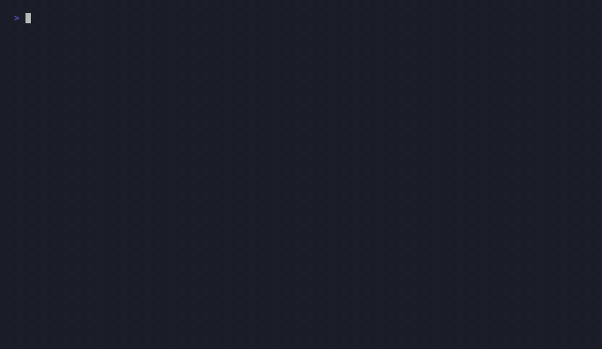

# Memeboat MCP

[](https://smithery.ai/servers/memeboat/memeboat) [](https://glama.ai/mcp/servers/memebo-at/memeboat-mcp)

MCP server for [Memeboat](https://memebo.at) — search **25,000+ meme templates** and create real, shareable memes straight from your AI assistant. Free, anonymous, no API key.



Ask your assistant things like:

> "Make a Buzz Lightyear *everywhere* meme about code reviews"

…and it will search the catalog, caption the template, and hand you back a live meme URL:

```
https://memebo.at/meme/x-x-everywhere-code-reviews-code-reviews-everywhere-ab12cd
```

## Install

### No install — connect by URL (recommended)

Memeboat is also hosted as a remote MCP server at **`https://memebo.at/mcp`** (streamable HTTP, no auth):

```bash
claude mcp add --transport http memeboat https://memebo.at/mcp
```

In Claude (web/desktop): Settings → Connectors → Add custom connector → `https://memebo.at/mcp`.

### npm package (stdio)

Requires Node.js 18+.

#### Claude Code

```bash
claude mcp add memeboat -- npx -y memeboat-mcp
```

#### Claude Desktop

Add to `claude_desktop_config.json`:

```json
{
  "mcpServers": {
    "memeboat": {
      "command": "npx",
      "args": ["-y", "memeboat-mcp"]
    }
  }
}
```

#### Cursor / other MCP clients

Any client that speaks stdio MCP works the same way: run `npx -y memeboat-mcp`.

## Tools

| Tool | What it does |
|---|---|
| `search_meme_templates` | Search templates by name or topic (`query`, optional `limit`). Returns slugs, image URLs and a `suggestedCaptionCount` per template. |
| `get_meme_template` | Details for one template by slug: dimensions, image URL, caption count. |
| `create_meme` | Caption a template (`template` slug + `texts[]`, top-to-bottom) and get back the meme's page URL and direct image URL. Supports per-caption styling and layout (see below). |

Caption placement: 1 text = bottom caption, 2 texts = classic top/bottom, more texts fill the template's own caption boxes in order — matching `suggestedCaptionCount` gives the best results.

**Styling (`create_meme`):** each entry in `texts[]` can be a plain string or an object `{ text, color?, outline?, font? }`. Colors are a hex value (`#f00`/`#ff0000`) or one of `white`, `black`, `red`, `yellow`, `blue`, `green`; leave `outline` off and a readable outline is picked for you. A top-level `font` sets the default for every caption, and `layout: "top"` puts the captions in a white bar above the image instead of overlaying them. Fonts: `impact`, `arial`, `helvetica`, `times`, `courier`, `titillium`, `thick`, `kalam`, `comic`, `notosans`, `notosanshebrew`.

> "Make a drake meme, red top caption, in the *top* layout"

## How it works

This package is a thin stdio client over Memeboat's public JSON API (`https://memebo.at/api/...`). Created memes are rendered server-side by Memeboat and hosted there — the image URL is immediately shareable. Creation is rate-limited per IP; be a good citizen.

Point the server at another instance with `MEMEBOAT_API_URL` (useful for development).

## Where to find it

- **Official MCP Registry:** `at.memebo/memeboat-mcp`
- **npm:** [memeboat-mcp](https://www.npmjs.com/package/memeboat-mcp)
- **Smithery:** [@memeboat/memeboat](https://smithery.ai/servers/memeboat/memeboat)
- **Glama:** [server](https://glama.ai/mcp/servers/memebo-at/memeboat-mcp) · [connector](https://glama.ai/mcp/connectors/at.memebo/memeboat-mcp)
- **mcp.so:** [memeboat](https://mcp.so/server/memeboat/memebo-at)

## About Memeboat

[Memeboat](https://memebo.at) is a free, anonymous meme generator — no sign-up, no login walls. Browse the full catalog at [memebo.at/templates](https://memebo.at/templates).

## License

[MIT](./LICENSE)
